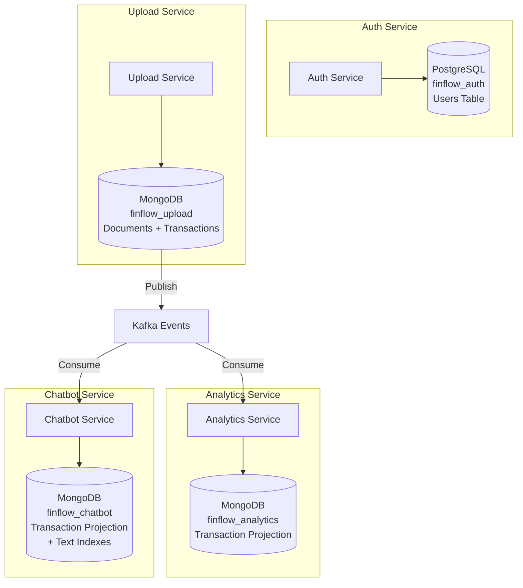

# Database Selection Strategy for Finflow Services

## Current State Analysis

All services currently use MongoDB. This plan analyzes each service's requirements and recommends optimal database choices based on:

- Data access patterns (read vs write ratio)
- Query complexity
- Consistency requirements
- Scalability needs
- Operational complexity

## Service-by-Service Analysis

### 1. Auth Service

**Current:** MongoDB (`finflow_auth`)

**Data Characteristics:**

- Simple schema: `{ email, password }`
- Low volume: User records (thousands to millions)
- Write pattern: Infrequent writes (registration, password updates)
- Read pattern: High-frequency reads (login, JWT validation)
- Query pattern: Simple lookups by email
- Consistency: Strong ACID needed (prevent duplicate emails)

**Recommendation: PostgreSQL**

**Rationale:**

1. **ACID Guarantees**: Critical for preventing duplicate emails during concurrent registrations
2. **Simple Schema**: Relational model fits perfectly (users table)
3. **Performance**: PostgreSQL handles simple lookups efficiently with B-tree indexes
4. **Maturity**: Battle-tested for authentication systems
5. **Constraints**: Native unique constraints, foreign keys if needed later
6. **Security**: Better encryption at rest, row-level security for multi-tenancy

**Schema Design:**

```sql
CREATE TABLE users (
    id UUID PRIMARY KEY DEFAULT gen_random_uuid(),
    email VARCHAR(255) UNIQUE NOT NULL,
    password_hash VARCHAR(255) NOT NULL,
    created_at TIMESTAMP DEFAULT NOW(),
    updated_at TIMESTAMP DEFAULT NOW()
);

CREATE INDEX idx_users_email ON users(email);
```

**Migration Complexity:** Low (simple schema, straightforward migration)

---

### 2. Upload Service

**Current:** MongoDB (`finflow_upload`)

**Data Characteristics:**

- Two collections: `documentuploads`, `transactions`
- Write-heavy: Bulk transaction inserts (100s per document)
- Read pattern: Document status checks, transaction listing
- Query pattern: Filtering by userId, documentId, date ranges
- Consistency: Eventual consistency acceptable (Kafka events)
- Volume: High transaction volume (millions of transactions)

**Recommendation: MongoDB (Keep)**

**Rationale:**

1. **Bulk Writes**: MongoDB's `insertMany()` is optimized for bulk operations
2. **Schema Flexibility**: Transaction schema may evolve (new fields, categories)
3. **Document Model**: Transactions are naturally document-oriented
4. **Horizontal Scaling**: Native sharding by userId when needed
5. **Write Performance**: Better write throughput than PostgreSQL for bulk inserts
6. **No Complex Joins**: Simple queries don't benefit from relational model

**Optimizations:**

- Compound indexes: `{userId: 1, date: -1}`, `{userId: 1, category: 1}`
- Write concern: `{w: 1}` for performance (acknowledge after primary)
- Connection pooling: Optimize for write-heavy workload

**Alternative Considered:** PostgreSQL

- **Rejected because:** Bulk inserts slower, schema changes require migrations, no native sharding

---

### 3. Analytics Service

**Current:** MongoDB (`finflow_analytics`)

**Data Characteristics:**

- Read-only projection: Transaction data replicated from Upload Service
- Read-heavy: 90%+ reads, writes only from Kafka events
- Query pattern: Complex aggregations ($group, $facet, $match)
- Performance requirement: Sub-500ms for analytics queries
- Volume: Millions of transactions, frequent aggregations

**Recommendation: MongoDB (Keep) OR TimescaleDB (Future)**

**Current Choice: MongoDB**

**Rationale:**

1. **Aggregation Pipeline**: MongoDB's $facet, $group optimized for analytics
2. **Flexible Schema**: Can add computed fields without migrations
3. **Read Performance**: Optimized indexes for aggregation queries
4. **Horizontal Scaling**: Read replicas for query distribution
5. **Time-Series Queries**: Date-based aggregations work well

**Future Consideration: TimescaleDB (PostgreSQL Extension)**

**When to Consider:**

- Time-series analytics become primary use case
- Need advanced time-series functions (time_bucket, continuous aggregates)
- Require compression for historical data
- Need integration with PostgreSQL ecosystem

**TimescaleDB Benefits:**

- Automatic partitioning by time
- Continuous aggregates (pre-computed rollups)
- Better compression for historical data
- SQL-based analytics (easier for analysts)

**Migration Path:**

- Keep MongoDB for now (works well)
- Evaluate TimescaleDB when:
  - Analytics queries become more time-series focused
  - Need better compression
  - Team prefers SQL for analytics

---

### 4. Chatbot Service

**Current:** MongoDB (`finflow_chatbot`)

**Data Characteristics:**

- Read-only projection: Transaction data replicated from Upload Service
- Read-heavy: 95%+ reads, writes only from Kafka events
- Query pattern: Text search, filtering, aggregations
- Performance requirement: Sub-200ms for chat responses
- Volume: Millions of transactions, frequent searches

**Recommendation: MongoDB with Atlas Search OR Elasticsearch (Future)**

**Current Choice: MongoDB with Text Indexes**

**Rationale:**

1. **Text Search**: MongoDB text indexes for description/merchant search
2. **Flexible Queries**: Supports both structured and unstructured queries
3. **Read Performance**: Optimized for read-heavy workloads
4. **Simple Integration**: Same database technology as other services

**Optimizations:**

```typescript
// Text index for search
TransactionSchema.index({
  description: "text",
  rawMerchant: "text",
});

// Compound index for filtering
TransactionSchema.index({ userId: 1, date: -1 });
```

**Future Consideration: Elasticsearch**

**When to Consider:**

- Need advanced NLP/search capabilities
- Require fuzzy matching, synonyms
- Need relevance scoring
- Complex search queries become primary use case

**Elasticsearch Benefits:**

- Advanced full-text search (fuzzy, synonyms, relevance)
- Better NLP integration
- Real-time search indexing
- Better for conversational queries

**Migration Path:**

- Start with MongoDB text indexes
- Add Elasticsearch when:
  - Search becomes core feature
  - Need advanced NLP capabilities
  - Query complexity increases

---

## Recommended Database Architecture



## Summary Table

| Service               | Recommended DB                     | Current DB | Migration Priority | Rationale                                           |
| --------------------- | ---------------------------------- | ---------- | ------------------ | --------------------------------------------------- |
| **Auth Service**      | **PostgreSQL**                     | MongoDB    | **High**           | ACID guarantees, simple schema, better for auth     |
| **Upload Service**    | **MongoDB**                        | MongoDB    | **None**           | Bulk writes, schema flexibility, horizontal scaling |
| **Analytics Service** | **MongoDB** (TimescaleDB future)   | MongoDB    | **None**           | Aggregation pipeline, read performance              |
| **Chatbot Service**   | **MongoDB** (Elasticsearch future) | MongoDB    | **None**           | Text search, read performance, simple integration   |

## Migration Strategy

### Phase 1: Auth Service Migration (High Priority)

**Timeline:** 2-3 weeks

**Steps:**

1. Set up PostgreSQL database
2. Create users table schema
3. Implement dual-write pattern (write to both MongoDB and PostgreSQL)
4. Migrate existing users
5. Switch reads to PostgreSQL
6. Remove MongoDB dependency

**Risk:** Low (simple schema, can rollback easily)

**Benefits:**

- Strong ACID guarantees
- Better security features
- Industry standard for auth

### Phase 2: Optimize Analytics (Optional, Future)

**Timeline:** 3-4 weeks (when needed)

**Consider TimescaleDB if:**

- Time-series queries become primary use case
- Need better compression
- Team prefers SQL

**Migration Complexity:** Medium (need to rebuild projections)

### Phase 3: Enhance Chatbot Search (Optional, Future)

**Timeline:** 4-6 weeks (when needed)

**Consider Elasticsearch if:**

- Search becomes core feature
- Need advanced NLP
- Query complexity increases

**Migration Complexity:** Medium (need to sync data)

## Operational Considerations

### Multi-Database Management

**Challenges:**

- Different backup strategies
- Different monitoring tools
- Team expertise in multiple technologies

**Mitigation:**

- Standardize on PostgreSQL + MongoDB (only 2 types)
- Use managed services (AWS RDS, MongoDB Atlas)
- Cross-train team members
- Document operational procedures

### Cost Considerations

**PostgreSQL (Auth):**

- AWS RDS: ~$50-100/month (small instance)
- Managed service reduces operational overhead

**MongoDB (Upload, Analytics, Chatbot):**

- MongoDB Atlas: ~$100-200/month per cluster
- Can share cluster across services (different databases)

**Total Estimated Cost:** $300-500/month (development/staging)

## Decision Matrix

### Auth Service: PostgreSQL vs MongoDB

| Criteria                     | PostgreSQL         | MongoDB            | Winner         |
| ---------------------------- | ------------------ | ------------------ | -------------- |
| ACID Guarantees              | ✅ Strong          | ⚠️ Single-doc only | PostgreSQL     |
| Simple Schema                | ✅ Perfect fit     | ✅ Works           | Tie            |
| Performance (Simple Lookups) | ✅ Excellent       | ✅ Good            | PostgreSQL     |
| Operational Complexity       | ✅ Standard        | ✅ Standard        | Tie            |
| Security Features            | ✅ Better          | ⚠️ Good            | PostgreSQL     |
| **Overall**                  | **✅ Recommended** | ⚠️ Acceptable      | **PostgreSQL** |

### Upload Service: MongoDB vs PostgreSQL

| Criteria           | MongoDB            | PostgreSQL             | Winner      |
| ------------------ | ------------------ | ---------------------- | ----------- |
| Bulk Writes        | ✅ Excellent       | ⚠️ Good                | MongoDB     |
| Schema Flexibility | ✅ High            | ⚠️ Requires migrations | MongoDB     |
| Horizontal Scaling | ✅ Native sharding | ⚠️ Complex             | MongoDB     |
| Write Performance  | ✅ Optimized       | ⚠️ Good                | MongoDB     |
| **Overall**        | **✅ Recommended** | ⚠️ Acceptable          | **MongoDB** |

### Analytics Service: MongoDB vs TimescaleDB

| Criteria              | MongoDB            | TimescaleDB   | Winner      |
| --------------------- | ------------------ | ------------- | ----------- |
| Aggregation Pipeline  | ✅ Excellent       | ⚠️ SQL (good) | MongoDB     |
| Time-Series Functions | ⚠️ Good            | ✅ Excellent  | TimescaleDB |
| Read Performance      | ✅ Excellent       | ✅ Excellent  | Tie         |
| Compression           | ⚠️ Manual          | ✅ Automatic  | TimescaleDB |
| **Current**           | **✅ Recommended** | Future option | **MongoDB** |

### Chatbot Service: MongoDB vs Elasticsearch

| Criteria               | MongoDB            | Elasticsearch   | Winner        |
| ---------------------- | ------------------ | --------------- | ------------- |
| Text Search            | ✅ Good            | ✅ Excellent    | Elasticsearch |
| Read Performance       | ✅ Excellent       | ✅ Excellent    | Tie           |
| NLP Integration        | ⚠️ Basic           | ✅ Advanced     | Elasticsearch |
| Operational Complexity | ✅ Simple          | ⚠️ More complex | MongoDB       |
| **Current**            | **✅ Recommended** | Future option   | **MongoDB**   |

## Implementation Plan

### Immediate Actions (Next Sprint)

1. **Evaluate PostgreSQL for Auth Service**

- Set up PostgreSQL instance (local/dev)
- Create users table schema
- Test migration script
- Performance benchmark

1. **Optimize MongoDB for Upload Service**

- Review indexes
- Optimize write concern
- Connection pooling tuning

1. **Enhance MongoDB for Analytics**

- Review aggregation queries
- Optimize indexes
- Consider read replicas

1. **Add Text Indexes for Chatbot**

- Implement text indexes on description/merchant
- Test search performance
- Optimize queries

### Future Considerations

1. **TimescaleDB for Analytics** (6+ months)

- Evaluate when time-series becomes primary use case
- Consider compression needs
- Team SQL expertise

1. **Elasticsearch for Chatbot** (6+ months)

- Evaluate when search becomes core feature
- Consider NLP requirements
- Query complexity assessment

## Conclusion

**Recommended Architecture:**

- **Auth Service**: PostgreSQL (migrate from MongoDB)
- **Upload Service**: MongoDB (keep)
- **Analytics Service**: MongoDB (keep, consider TimescaleDB later)
- **Chatbot Service**: MongoDB (keep, consider Elasticsearch later)

**Rationale:**

- PostgreSQL for Auth: Better ACID guarantees, security, industry standard
- MongoDB for others: Better fit for document model, bulk writes, aggregations
- Future options: TimescaleDB and Elasticsearch when specific needs arise

**Migration Priority:**

1. **High**: Auth Service → PostgreSQL
2. **Low**: Others (work well with MongoDB, optimize instead)
