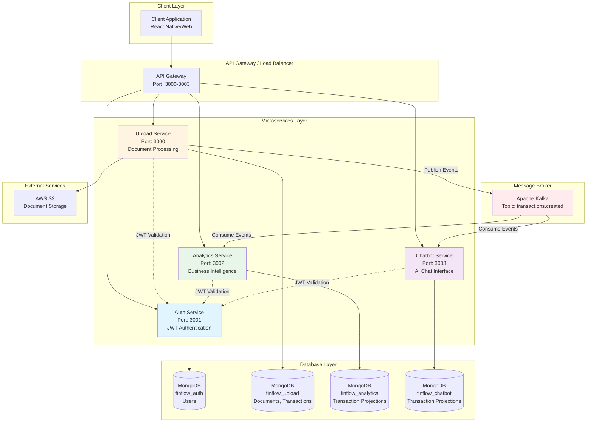

# Finflow Backend Architecture Documentation

## 1. System Architecture Diagram

## 2. Service Responsibilities

### Auth Service (Port 3001)
- **Purpose**: User authentication and authorization
- **Database**: `finflow_auth` (MongoDB)
- **Key Features**:
  - User registration and login
  - JWT token generation (12h expiration)
  - Password hashing with bcrypt
  - JWT validation for other services

### Upload Service (Port 3000)
- **Purpose**: Document upload and transaction extraction
- **Database**: `finflow_upload` (MongoDB)
- **Key Features**:
  - PDF document upload to S3
  - PDF parsing and transaction extraction
  - Transaction categorization
  - **Event Producer**: Publishes `TransactionCreatedEvent` to Kafka
- **Storage**: AWS S3 for document files

### Analytics Service (Port 3002)
- **Purpose**: Financial analytics and insights
- **Database**: `finflow_analytics` (MongoDB - read model/projection)
- **Key Features**:
  - **Event Consumer**: Consumes `TransactionCreatedEvent` from Kafka
  - Maintains local transaction projection for fast queries
  - Category spending analysis
  - Monthly expense trends
  - Transaction summary and filtering
- **Architecture Pattern**: Event-driven read model

### Chatbot Service (Port 3003)
- **Purpose**: AI-powered financial chat interface
- **Database**: `finflow_chatbot` (MongoDB - read model/projection)
- **Key Features**:
  - **Event Consumer**: Consumes `TransactionCreatedEvent` from Kafka
  - Maintains local transaction projection
  - Natural language query processing
  - Financial insights via chat

## 3. Communication Patterns

### Synchronous (HTTP/REST)
- Client ↔ All Services (REST API)
- Services ↔ Auth Service (JWT validation)

### Asynchronous (Event-Driven via Kafka)
- Upload Service → Kafka → Analytics Service
- Upload Service → Kafka → Chatbot Service

### Event Flow
1. User uploads PDF → Upload Service
2. Upload Service extracts transactions → Saves to `finflow_upload` DB
3. Upload Service publishes `TransactionCreatedEvent` → Kafka topic `transactions.created`
4. Analytics Service & Chatbot Service consume events → Update their local projections

## 4. Technology Stack

- **Framework**: NestJS (TypeScript)
- **Database**: MongoDB (Mongoose ODM)
- **Message Broker**: Apache Kafka (kafkajs)
- **Authentication**: JWT (passport-jwt)
- **Storage**: AWS S3
- **API Versioning**: URI-based (`/v1/...`)
