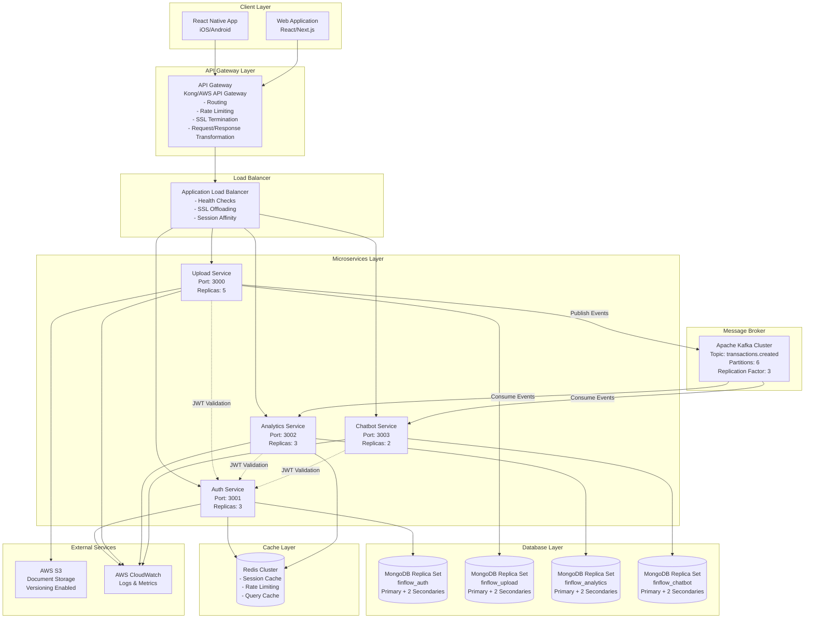

# Finflow Architecture Interview Guide & Documentation

## Table of Contents
1. [Requirements Analysis](#requirements-analysis)
2. [System Architecture Deep Dive](#system-architecture-deep-dive)
3. [Design Decisions & Rationale](#design-decisions--rationale)
4. [Architecture Patterns](#architecture-patterns)
5. [Non-Functional Requirements](#non-functional-requirements)
6. [MVP vs Full Product Strategy](#mvp-vs-full-product-strategy)
7. [Interview Questions & Answers](#interview-questions--answers)
8. [Improvement Roadmap](#improvement-roadmap)
9. [CI/CD & DevOps](#cicd--devops)

---

## 1. Requirements Analysis

### 1.1 Functional Requirements (FR)

**Core Features:**
1. **User Management**
   - User registration with email/password
   - User authentication (JWT-based)
   - Session management (12h token expiration)

2. **Document Processing**
   - PDF upload (with optional password support)
   - PDF parsing and transaction extraction
   - Transaction categorization (7 categories)
   - Document status tracking (uploaded → extracting → completed/failed)

3. **Financial Analytics**
   - Transaction summary (total debit/credit/count)
   - Category-wise spending breakdown with percentages
   - Monthly expense trends (line chart data)
   - Transaction filtering (category, type, date range, search)
   - Highest month expense identification
   - Top category spending percentage

4. **AI Chatbot**
   - Natural language queries about transactions
   - Financial insights via conversational interface

5. **Data Synchronization**
   - Event-driven transaction replication
   - Real-time analytics updates

### 1.2 Non-Functional Requirements (NFR)

**Performance:**
- API response time < 200ms (p95)
- Analytics queries < 500ms
- PDF processing < 30 seconds for typical documents
- Support 1000+ concurrent users

**Scalability:**
- Horizontal scaling for all services
- Database sharding capability
- Kafka partition scaling
- Auto-scaling based on load

**Availability:**
- 99.9% uptime (8.76 hours downtime/year)
- Multi-AZ deployment
- Graceful degradation
- Circuit breaker pattern

**Security:**
- JWT authentication
- Password hashing (bcrypt)
- Input validation
- HTTPS/TLS encryption
- Rate limiting
- SQL injection prevention (NoSQL injection)

**Reliability:**
- Eventual consistency tolerance (< 1s lag)
- Idempotent operations
- Retry mechanisms
- Dead letter queue handling

**Observability:**
- Centralized logging
- Distributed tracing
- Metrics collection (Prometheus)
- Alerting (Grafana/CloudWatch)
- Health checks

**Maintainability:**
- Code quality (SonarQube)
- Linting (ESLint)
- Type safety (TypeScript)
- Documentation
- Test coverage (> 80%)

---

## 2. System Architecture Deep Dive

### 2.1 High-Level Architecture



### 2.2 Service Communication Patterns

#### Synchronous Communication (HTTP/REST)
- **Client ↔ Services**: RESTful API calls
- **Service ↔ Auth Service**: JWT validation (internal API calls)
- **Protocol**: HTTP/1.1 or HTTP/2
- **Timeout**: 5 seconds for internal calls, 30 seconds for client calls
- **Retry**: Exponential backoff (3 attempts)

#### Asynchronous Communication (Event-Driven)
- **Upload Service → Kafka**: Transaction creation events
- **Kafka → Analytics/Chatbot Services**: Event consumption
- **Protocol**: Kafka Protocol
- **Guarantees**: At-least-once delivery
- **Partitioning**: By `userId` for ordered processing per user

### 2.3 Database Architecture

**Database per Service Pattern:**
- Each microservice owns its database
- No shared database access between services
- Data synchronization via events only

**Replication Strategy:**
- MongoDB Replica Sets (Primary + 2 Secondaries)
- Read preference: Primary for writes, SecondaryPreferred for reads
- Automatic failover (< 30 seconds)

**Sharding Strategy (Future):**
- Shard by `userId` hash
- 3 shards initially, scale to 6 as needed
- Shard key: `userId` (ensures user data locality)

---

## 3. Design Decisions & Rationale

### 3.1 Why MongoDB Instead of SQL?

**Decision:** MongoDB (NoSQL) for all services

**Rationale:**

1. **Schema Flexibility**
   - Transaction schema may evolve (new fields, categories)
   - No migration overhead for schema changes
   - JSON-like documents match application data structures

2. **Horizontal Scalability**
   - Native sharding support
   - Better suited for distributed systems
   - Easier to scale reads with replica sets

3. **Performance for Analytics**
   - Aggregation pipeline optimized for analytics queries
   - Flexible indexing (compound, text, geospatial)
   - Better performance for read-heavy workloads

4. **Document Model**
   - Transactions are naturally document-oriented
   - Embedded arrays for categories/transactions
   - No complex joins needed

5. **Development Speed**
   - Faster development cycle
   - Less boilerplate (no ORM migrations)
   - TypeScript integration with Mongoose

**Trade-offs:**
- ❌ No ACID transactions across collections (mitigated with single-document transactions)
- ❌ No foreign key constraints (handled at application level)
- ❌ Less mature tooling than PostgreSQL

**When SQL Would Be Better:**
- Complex relational queries with multiple joins
- Strong ACID requirements across entities
- Existing SQL expertise in team
- Regulatory requirements for relational integrity

### 3.2 Why Multiple Databases Instead of Single Database?

**Decision:** Database per Service (4 separate MongoDB databases)

**Rationale:**

1. **Microservices Independence**
   - Each service can evolve independently
   - No schema conflicts between services
   - Independent scaling per service

2. **Data Ownership**
   - Clear ownership boundaries
   - Upload Service owns transaction source of truth
   - Analytics/Chatbot own their projections

3. **Performance Isolation**
   - Heavy analytics queries don't impact upload operations
   - Independent performance tuning
   - Separate connection pools

4. **Fault Isolation**
   - Database failure in one service doesn't affect others
   - Independent backup/restore strategies
   - Different retention policies

5. **Team Autonomy**
   - Different teams can manage their databases
   - Independent deployment schedules
   - Technology flexibility (could use different DBs)

**Trade-offs:**
- ❌ Data consistency challenges (solved with event-driven replication)
- ❌ More operational overhead (4 databases to manage)
- ❌ Cross-service queries require API calls or events

**Alternative Considered:**
- Single database with separate schemas/collections
- **Rejected because:** Tight coupling, shared failure domain, harder to scale independently

### 3.3 Why Not PostgreSQL for Auth Service?

**Decision:** MongoDB for Auth Service (not PostgreSQL)

**Rationale:**

1. **Consistency Across Stack**
   - Same database technology reduces operational complexity
   - Single set of backup/restore tools
   - Unified monitoring and alerting

2. **Simple Schema**
   - Auth service has simple schema (users table)
   - No complex relationships or joins
   - MongoDB handles this use case well

3. **Scalability**
   - MongoDB sharding easier than PostgreSQL partitioning
   - Better horizontal scaling for high user volumes
   - Read scaling with replica sets

4. **Team Expertise**
   - Team already familiar with MongoDB
   - Reduces learning curve
   - Faster development

**When PostgreSQL Would Be Better:**
- Complex user roles/permissions (RBAC)
- Need for ACID transactions across user operations
- Integration with existing PostgreSQL infrastructure
- Regulatory requirements for SQL databases

**PostgreSQL Alternative Design (If Needed):**
```sql
-- Users table
CREATE TABLE users (
    id UUID PRIMARY KEY DEFAULT gen_random_uuid(),
    email VARCHAR(255) UNIQUE NOT NULL,
    password_hash VARCHAR(255) NOT NULL,
    created_at TIMESTAMP DEFAULT NOW(),
    updated_at TIMESTAMP DEFAULT NOW()
);

-- Indexes
CREATE INDEX idx_users_email ON users(email);
```

### 3.4 How We Decided on Different Services?

**Service Decomposition Strategy:**

1. **Domain-Driven Design (DDD)**
   - Identified bounded contexts:
     - **Auth Context**: User authentication/authorization
     - **Upload Context**: Document processing and transaction extraction
     - **Analytics Context**: Financial insights and reporting
     - **Chatbot Context**: AI-powered conversational interface

2. **Single Responsibility Principle**
   - Each service has one clear purpose
   - Auth: Only authentication
   - Upload: Only document processing
   - Analytics: Only analytics queries
   - Chatbot: Only chat functionality

3. **Data Ownership**
   - Upload Service owns transaction write model
   - Analytics/Chatbot own read models (projections)
   - Clear data flow via events

4. **Scalability Requirements**
   - Upload Service: CPU-intensive (PDF parsing) → More replicas
   - Analytics Service: Memory-intensive (aggregations) → Larger instances
   - Chatbot Service: AI/LLM calls → Different scaling pattern

5. **Team Structure**
   - Different teams can own different services
   - Independent deployment schedules
   - Technology flexibility

**Service Boundaries:**
```
Auth Service:          User management, JWT generation
Upload Service:        Document upload, PDF parsing, Transaction creation (write)
Analytics Service:     Transaction queries, Aggregations, Reporting (read)
Chatbot Service:        Natural language processing, Chat interface (read)
```

---

## 4. Architecture Patterns

### 4.1 Pattern 1: Microservices Architecture

**Description:**
- System decomposed into small, independent services
- Each service runs in its own process
- Services communicate via well-defined APIs

**Implementation:**
- 4 independent NestJS services
- Each service has its own database
- RESTful APIs for synchronous communication

**Benefits:**
- Independent deployment
- Technology diversity
- Fault isolation
- Team autonomy

**Challenges:**
- Distributed system complexity
- Network latency
- Data consistency
- Operational overhead

### 4.2 Pattern 2: Event-Driven Architecture (EDA)

**Description:**
- Services communicate via events
- Loose coupling between services
- Asynchronous processing

**Implementation:**
- Upload Service publishes `TransactionCreatedEvent` to Kafka
- Analytics/Chatbot Services consume events
- Eventual consistency model

**Benefits:**
- Decoupling
- Scalability
- Resilience
- Flexibility

**Event Flow:**
```
Upload Service (Producer)
  ↓
Kafka Topic: transactions.created
  ↓
Analytics Service (Consumer Group 1)
Chatbot Service (Consumer Group 2)
```

### 4.3 Pattern 3: CQRS (Command Query Responsibility Segregation)

**Description:**
- Separate read and write models
- Write model optimized for writes
- Read models optimized for queries

**Implementation:**
- **Write Model**: Upload Service (transaction creation)
- **Read Models**: Analytics Service, Chatbot Service (transaction queries)
- Synchronization via Kafka events

**Benefits:**
- Optimized performance
- Independent scaling
- Schema flexibility
- Clear separation

**Read Model Benefits:**
- Analytics Service: Optimized indexes for aggregations
- Chatbot Service: Optimized for search queries
- No impact on write performance

### 4.4 Pattern 4: Database per Service

**Description:**
- Each microservice has its own database
- No shared database access
- Data synchronization via APIs or events

**Implementation:**
- 4 separate MongoDB databases
- Each service connects only to its database
- Data replication via Kafka events

**Benefits:**
- Service autonomy
- Technology flexibility
- Independent scaling
- Fault isolation

**Data Synchronization:**
- Upload Service → Kafka → Analytics/Chatbot Services
- Eventual consistency (< 1 second lag)
- Idempotent operations

---

## 5. Non-Functional Requirements

### 5.1 Monitoring & Observability

**Current State:**
- Basic health checks (`/health` endpoints)
- Console logging

**Target State:**

#### Prometheus Metrics
```yaml
Metrics to Collect:
  - HTTP request rate (requests/sec)
  - HTTP request latency (p50, p95, p99)
  - Error rate (4xx, 5xx)
  - Database query latency
  - Kafka consumer lag
  - PDF processing time
  - Active connections
  - Memory/CPU usage
```

#### Grafana Dashboards
- Service health dashboard
- API performance dashboard
- Database performance dashboard
- Kafka consumer lag dashboard
- Error rate dashboard

#### CloudWatch Integration
- Log aggregation
- Custom metrics
- Alarms (CPU, memory, error rate)
- Log insights queries

#### Application Logging
- Structured logging (JSON format)
- Log levels (DEBUG, INFO, WARN, ERROR)
- Correlation IDs for request tracing
- Log aggregation (ELK stack or CloudWatch Logs)

#### Distributed Tracing
- OpenTelemetry integration
- Trace IDs across services
- Span visualization (Jaeger/Zipkin)
- Performance bottleneck identification

#### Accessibility Standards
- WCAG 2.1 AA compliance (frontend)
- Screen reader support
- Keyboard navigation
- Color contrast ratios

### 5.2 Security & Performance

#### JWT Authentication
**Current:**
- JWT tokens with 12h expiration
- Passport JWT strategy

**Enhancements:**
- Refresh tokens (7 days)
- Token rotation
- Token blacklisting (Redis)
- Rate limiting per user

#### Input Validation
**Current:**
- class-validator decorators
- ValidationPipe with whitelist

**Enhancements:**
- Custom validators for business rules
- Sanitization (XSS prevention)
- File upload validation (size, type)
- SQL injection prevention (parameterized queries)

#### HTTPS/TLS
- SSL certificates (Let's Encrypt or AWS Certificate Manager)
- TLS 1.3 enforcement
- HSTS headers
- Certificate rotation

#### Rate Limiting
**Implementation:**
- Redis-based rate limiting
- Per-user limits (100 requests/min)
- Per-IP limits (1000 requests/min)
- Different limits per endpoint

**NestJS Implementation:**
```typescript
@Throttle({ default: { limit: 100, ttl: 60000 } })
```

### 5.3 Caching & Data Optimization

#### Redis Caching Strategy

**Cache Layers:**

1. **Session Cache**
   - JWT tokens
   - User sessions
   - TTL: 12 hours

2. **Query Cache**
   - Analytics summary (TTL: 5 minutes)
   - Category spending (TTL: 10 minutes)
   - Monthly trends (TTL: 15 minutes)
   - Cache invalidation on new transactions

3. **Document Metadata Cache**
   - Document status (TTL: 1 minute)
   - User document list (TTL: 2 minutes)

**Cache Keys:**
```
analytics:summary:{userId}
analytics:categories:{userId}
analytics:monthly:{userId}
document:status:{documentId}
```

**Cache Invalidation:**
- On transaction creation → Invalidate analytics caches
- On document status change → Invalidate document cache

#### Rate Limiting (Redis)
- Sliding window algorithm
- Per-user and per-IP limits
- Distributed rate limiting

### 5.4 Scalability

#### Load Balancer Placement

**Option 1: API Gateway Level (Recommended)**
```
Client → API Gateway (Load Balancer) → Services
```
- Single point of entry
- Centralized SSL termination
- Request routing
- Rate limiting

**Option 2: Per Service**
```
Client → API Gateway → Service Load Balancer → Service Instances
```
- More granular control
- Service-specific policies
- Higher complexity

**Recommendation:** API Gateway level for simplicity

#### Auto Scaling

**Kubernetes HPA (Horizontal Pod Autoscaler):**
```yaml
Metrics:
  - CPU utilization (target: 70%)
  - Memory utilization (target: 80%)
  - Request rate (target: 100 req/sec per pod)

Scaling:
  - Min replicas: 2
  - Max replicas: 10
  - Scale up: +2 pods per minute
  - Scale down: -1 pod per 5 minutes
```

**Service-Specific Scaling:**
- **Upload Service**: CPU-based (PDF processing)
- **Analytics Service**: Memory-based (aggregations)
- **Auth Service**: Request rate-based
- **Chatbot Service**: Request rate-based

### 5.5 Availability (99.9% Uptime)

**Target:** 99.9% uptime = 8.76 hours downtime/year

#### Strategies:

1. **Multi-AZ Deployment**
   - Services deployed across 3 availability zones
   - Database replica sets across AZs
   - Automatic failover

2. **Health Checks**
   - Liveness probes (Kubernetes)
   - Readiness probes
   - Health check endpoints (`/health`)

3. **Circuit Breaker Pattern**
   - Prevents cascading failures
   - Open circuit after 5 failures
   - Half-open after 30 seconds
   - Close after successful request

**Implementation (NestJS):**
```typescript
@Injectable()
export class CircuitBreakerService {
  private state: 'closed' | 'open' | 'half-open' = 'closed';
  private failureCount = 0;
  private lastFailureTime: Date;

  async execute<T>(fn: () => Promise<T>): Promise<T> {
    if (this.state === 'open') {
      if (Date.now() - this.lastFailureTime.getTime() > 30000) {
        this.state = 'half-open';
      } else {
        throw new ServiceUnavailableException('Circuit breaker is open');
      }
    }

    try {
      const result = await fn();
      this.onSuccess();
      return result;
    } catch (error) {
      this.onFailure();
      throw error;
    }
  }
}
```

4. **Retry Mechanisms**
   - Exponential backoff
   - Max 3 retries
   - Idempotent operations

5. **Graceful Degradation**
   - Fallback responses
   - Cached data when service unavailable
   - Partial functionality

6. **Database Replication**
   - Primary + 2 Secondaries
   - Automatic failover
   - Read from secondaries

7. **Kafka High Availability**
   - 3 brokers (replication factor: 3)
   - Leader election
   - Partition replication

#### Monitoring & Alerting
- Uptime monitoring (Pingdom/UptimeRobot)
- Alert on downtime
- SLA tracking
- Incident response procedures

---

## 6. MVP vs Full Product Strategy

### 6.1 MVP Scope (Phase 1)

**Timeline:** 8-12 weeks

**In Scope:**
- ✅ User registration/login
- ✅ PDF upload and parsing
- ✅ Basic transaction extraction
- ✅ Transaction listing with filters
- ✅ Category spending summary
- ✅ Monthly expense chart
- ✅ Basic chatbot (rule-based)
- ✅ Event-driven replication (Kafka)

**Out of Scope:**
- ❌ Advanced analytics (predictions, trends)
- ❌ Multi-currency support
- ❌ Bank account integration
- ❌ Advanced AI chatbot (LLM integration)
- ❌ Real-time notifications
- ❌ Mobile app (web only)
- ❌ Advanced security (2FA, OAuth)
- ❌ Comprehensive monitoring
- ❌ Auto-scaling
- ❌ Multi-region deployment

**Success Criteria:**
- Core functionality working
- Basic performance (< 1s API response)
- Basic security (JWT, input validation)
- Single region deployment
- Manual scaling

### 6.2 Full Product Scope (Phase 2+)

**Timeline:** 6-12 months

**Phase 2 (Months 1-3):**
- Advanced analytics (predictions, anomaly detection)
- LLM-powered chatbot
- Real-time notifications
- Mobile app (React Native)
- Advanced security (2FA, OAuth)
- Comprehensive monitoring (Prometheus, Grafana)
- Auto-scaling

**Phase 3 (Months 4-6):**
- Multi-currency support
- Bank account integration (Plaid/Yodlee)
- Advanced reporting (PDF exports)
- Multi-region deployment
- Disaster recovery
- Performance optimization

**Phase 4 (Months 7-12):**
- Enterprise features
- Advanced RBAC
- Audit logging
- Compliance (SOC 2, GDPR)
- Advanced caching strategies
- Database sharding

### 6.3 Decision Framework

**MVP Decision Criteria:**
1. **User Value**: Does it solve core user problem?
2. **Time to Market**: Can we ship in 8-12 weeks?
3. **Technical Risk**: Low risk, proven technologies
4. **Resource Constraints**: Small team, limited budget

**Full Product Decision Criteria:**
1. **User Feedback**: What do users actually need?
2. **Business Metrics**: Revenue, user growth
3. **Competitive Advantage**: What differentiates us?
4. **Scalability**: Can it handle growth?

---

## 7. Interview Questions & Answers

### 7.1 Architecture Questions

#### Q1: Why did you choose microservices over monolith?

**Answer:**
"We chose microservices because:
1. **Independent Scaling**: Upload service (CPU-intensive) needs more CPU, Analytics (memory-intensive) needs more RAM
2. **Team Autonomy**: Different teams can own different services
3. **Technology Flexibility**: Could use different tech stacks if needed
4. **Fault Isolation**: Failure in one service doesn't bring down entire system
5. **Deployment Independence**: Deploy analytics updates without affecting upload service

However, we're aware of the trade-offs: increased complexity, network latency, distributed transactions. We mitigate these with event-driven architecture and eventual consistency."

#### Q2: How do you handle data consistency across services?

**Answer:**
"We use **eventual consistency** with Kafka:
1. **Write Model**: Upload Service is single source of truth
2. **Read Models**: Analytics/Chatbot Services maintain projections
3. **Synchronization**: Kafka events ensure data replication
4. **Idempotency**: Upsert operations prevent duplicates
5. **Lag Tolerance**: < 1 second lag is acceptable for analytics

For critical operations requiring immediate consistency, we use synchronous API calls with retries."

#### Q3: What happens if Kafka goes down?

**Answer:**
"Multi-layered approach:
1. **Kafka High Availability**: 3 brokers with replication factor 3
2. **Producer Retries**: Upload Service retries failed publishes
3. **Consumer Lag Monitoring**: Alert if lag exceeds threshold
4. **Dead Letter Queue**: Failed messages go to DLQ for manual processing
5. **Fallback**: If Kafka is down, Analytics can query Upload Service directly (degraded mode)

We also have monitoring to detect Kafka failures and alert immediately."

#### Q4: How do you ensure 99.9% availability?

**Answer:**
"Multiple strategies:
1. **Multi-AZ Deployment**: Services across 3 availability zones
2. **Database Replication**: Primary + 2 secondaries, automatic failover
3. **Health Checks**: Kubernetes liveness/readiness probes
4. **Circuit Breaker**: Prevents cascading failures
5. **Retry Mechanisms**: Exponential backoff for transient failures
6. **Graceful Degradation**: Fallback to cached data or reduced functionality
7. **Monitoring**: Real-time alerts on service health

We track uptime metrics and have incident response procedures."

#### Q5: How would you scale this system to 1 million users?

**Answer:**
"Horizontal scaling strategy:
1. **Services**: Auto-scale based on CPU/memory/request rate
2. **Databases**: MongoDB sharding by userId (3 shards → 6 → 12)
3. **Kafka**: Increase partitions (6 → 12 → 24)
4. **Caching**: Redis cluster for distributed caching
5. **CDN**: Static assets via CloudFront
6. **Load Balancing**: Multi-region deployment
7. **Database Optimization**: Read replicas, query optimization
8. **Caching Strategy**: Aggressive caching of analytics queries

We'd also implement:
- Database connection pooling
- Query result pagination
- Batch processing for heavy operations
- Async processing for non-critical tasks"

### 7.2 Design Pattern Questions

#### Q6: Explain the CQRS pattern you're using.

**Answer:**
"We implement CQRS with:
- **Write Model**: Upload Service writes transactions (optimized for writes)
- **Read Models**: Analytics/Chatbot Services (optimized for reads)
- **Separation**: Different schemas/indexes for read vs write
- **Sync**: Kafka events keep read models updated

Benefits:
- Write performance not affected by read queries
- Read models optimized for specific query patterns
- Independent scaling of read/write workloads"

#### Q7: Why event-driven architecture?

**Answer:**
"Event-driven architecture provides:
1. **Loose Coupling**: Services don't know about each other
2. **Scalability**: Consumers scale independently
3. **Resilience**: If one consumer fails, others continue
4. **Flexibility**: Easy to add new consumers (e.g., notification service)
5. **Performance**: Async processing doesn't block writes

We use Kafka for:
- Reliable message delivery
- Partitioning for parallel processing
- Consumer groups for load balancing"

### 7.3 Database Questions

#### Q8: Why MongoDB instead of PostgreSQL?

**Answer:**
"Chose MongoDB because:
1. **Schema Flexibility**: Transaction schema evolves frequently
2. **Analytics Performance**: Aggregation pipeline optimized for analytics
3. **Horizontal Scaling**: Native sharding support
4. **Document Model**: Transactions are naturally document-oriented
5. **Development Speed**: Faster iteration without migrations

PostgreSQL would be better for:
- Complex relational queries
- Strong ACID requirements
- Existing SQL expertise"

#### Q9: How do you handle database migrations?

**Answer:"
"Strategy depends on service:
1. **Schema Changes**: Mongoose handles schema evolution
2. **Breaking Changes**: Version events (TransactionCreatedEventV2)
3. **Data Migration**: Scripts run during deployment
4. **Rollback**: Keep previous version until migration verified
5. **Zero Downtime**: Blue-green deployment

For read models (Analytics/Chatbot), we can rebuild from Kafka events if needed."

### 7.4 Performance Questions

#### Q10: How do you optimize slow queries?

**Answer:**
"Multi-pronged approach:
1. **Indexing**: Compound indexes on common query patterns
2. **Query Analysis**: Explain plans to identify bottlenecks
3. **Caching**: Redis cache for frequent queries
4. **Pagination**: Limit result sets
5. **Aggregation Optimization**: Use $match early in pipeline
6. **Connection Pooling**: Optimize database connections
7. **Read Replicas**: Distribute read load

We monitor slow query logs and set up alerts for queries > 500ms."

#### Q11: How do you handle PDF processing performance?

**Answer:"
"Optimization strategies:
1. **Async Processing**: Don't block API response
2. **Worker Pool**: Dedicated workers for PDF parsing
3. **Caching**: Cache parsed results for same document
4. **Streaming**: Process large PDFs in chunks
5. **Resource Limits**: Timeout after 30 seconds
6. **Queue System**: Queue heavy processing tasks

We also monitor PDF processing time and alert if > 30 seconds."

### 7.5 Security Questions

#### Q12: How do you secure JWT tokens?

**Answer:"
"Multiple layers:
1. **HTTPS Only**: Tokens only sent over TLS
2. **Short Expiration**: 12 hours (refresh tokens for longer sessions)
3. **Token Blacklisting**: Redis for revoked tokens
4. **Signature Verification**: RS256 algorithm
5. **Token Rotation**: Refresh tokens rotated on use
6. **Secure Storage**: HttpOnly cookies for web (if needed)

We also implement:
- Rate limiting per user
- IP-based restrictions
- Token validation on every request"

#### Q13: How do you prevent SQL injection?

**Answer:"
"MongoDB-specific:
1. **Parameterized Queries**: Mongoose uses parameterized queries
2. **Input Validation**: class-validator prevents malicious input
3. **No Raw Queries**: Avoid `$where` and raw JavaScript
4. **Sanitization**: Escape user input
5. **Least Privilege**: Database user with minimal permissions

We also:
- Regular security audits
- Dependency scanning
- Input sanitization libraries"

---

## 8. Improvement Roadmap

### 8.1 Immediate Improvements (Next Sprint)

#### 1. Add Redis Caching
**Priority:** High
**Effort:** 2-3 days
**Impact:** 50-70% reduction in database queries

**Implementation:**
```typescript
// Analytics Service
@Injectable()
export class AnalyticsService {
  constructor(
    @InjectModel(Transaction.name) private transactionModel: Model<TransactionDocument>,
    @Inject('REDIS_CLIENT') private redis: Redis,
  ) {}

  async getSummary(userId: string): Promise<InsightsSummary> {
    const cacheKey = `analytics:summary:${userId}`;
    const cached = await this.redis.get(cacheKey);
    if (cached) return JSON.parse(cached);

    const summary = await this.computeSummary(userId);
    await this.redis.setex(cacheKey, 300, JSON.stringify(summary)); // 5 min TTL
    return summary;
  }
}
```

#### 2. Implement Rate Limiting
**Priority:** High
**Effort:** 1-2 days
**Impact:** Prevents abuse, protects services

**Implementation:**
```typescript
// Global rate limiting
app.use(
  rateLimit({
    windowMs: 15 * 60 * 1000, // 15 minutes
    max: 100, // limit each IP to 100 requests per windowMs
    standardHeaders: true,
    legacyHeaders: false,
  }),
);
```

#### 3. Add Comprehensive Logging
**Priority:** High
**Effort:** 2-3 days
**Impact:** Better debugging and monitoring

**Implementation:**
```typescript
// Winston logger with correlation IDs
import { Logger } from '@nestjs/common';

@Injectable()
export class AppLogger extends Logger {
  log(message: string, context?: string, correlationId?: string) {
    super.log(JSON.stringify({ message, context, correlationId, timestamp: new Date() }));
  }
}
```

#### 4. Health Check Enhancements
**Priority:** Medium
**Effort:** 1 day
**Impact:** Better Kubernetes health checks

**Implementation:**
```typescript
@Controller('health')
export class HealthController {
  @Get()
  async check() {
    return {
      status: 'ok',
      timestamp: new Date().toISOString(),
      uptime: process.uptime(),
      database: await this.checkDatabase(),
      kafka: await this.checkKafka(),
    };
  }
}
```

### 8.2 Short-Term Improvements (Next Month)

#### 1. Circuit Breaker Implementation
**Priority:** High
**Effort:** 3-4 days
**Impact:** Prevents cascading failures

#### 2. Distributed Tracing (OpenTelemetry)
**Priority:** Medium
**Effort:** 4-5 days
**Impact:** End-to-end request tracing

#### 3. Prometheus Metrics
**Priority:** High
**Effort:** 3-4 days
**Impact:** Comprehensive metrics collection

#### 4. Grafana Dashboards
**Priority:** Medium
**Effort:** 2-3 days
**Impact:** Visual monitoring and alerting

#### 5. Refresh Tokens
**Priority:** Medium
**Effort:** 2-3 days
**Impact:** Better security and UX

### 8.3 Medium-Term Improvements (Next Quarter)

#### 1. Database Sharding
**Priority:** Medium (when needed)
**Effort:** 1-2 weeks
**Impact:** Horizontal database scaling

#### 2. Multi-Region Deployment
**Priority:** Low (when expanding)
**Effort:** 2-3 weeks
**Impact:** Global availability and latency reduction

#### 3. Advanced Analytics
**Priority:** Medium
**Effort:** 3-4 weeks
**Impact:** Predictive analytics, anomaly detection

#### 4. LLM Integration for Chatbot
**Priority:** Medium
**Effort:** 2-3 weeks
**Impact:** Better chatbot responses

#### 5. Mobile App (React Native)
**Priority:** High (user demand)
**Effort:** 6-8 weeks
**Impact:** Mobile user access

### 8.4 Long-Term Improvements (6+ Months)

#### 1. Bank Account Integration
**Priority:** Low
**Effort:** 4-6 weeks
**Impact:** Automatic transaction import

#### 2. Multi-Currency Support
**Priority:** Low
**Effort:** 2-3 weeks
**Impact:** International users

#### 3. Advanced RBAC
**Priority:** Low (enterprise feature)
**Effort:** 3-4 weeks
**Impact:** Enterprise customers

#### 4. Compliance (SOC 2, GDPR)
**Priority:** Medium (when needed)
**Effort:** 2-3 months
**Impact:** Enterprise readiness

---

## 9. CI/CD & DevOps

### 9.1 Branching Strategy

**Git Flow:**
```
main (production)
  ↑
release/* (staging)
  ↑
develop (integration)
  ↑
feature/* (development)
hotfix/* (urgent fixes)
```

**Branch Protection:**
- `main`: Require PR reviews, status checks, no direct pushes
- `develop`: Require PR reviews, status checks
- Auto-merge after approvals and CI passes

**CI/CD Pipeline:**
```
1. Feature Branch → Push
2. Pre-commit Hooks → Lint, Format
3. CI Pipeline:
   - Lint (ESLint)
   - Type Check (TypeScript)
   - Unit Tests
   - Build
   - Security Scan (Snyk/SonarQube)
4. PR Created → Require Reviews
5. Merge to develop → Deploy to Dev Environment
6. Merge to main → Deploy to Production
```

### 9.2 Pre-Commit Checks

**Husky + lint-staged:**
```json
{
  "husky": {
    "hooks": {
      "pre-commit": "lint-staged",
      "pre-push": "npm run test && npm run build"
    }
  },
  "lint-staged": {
    "*.ts": ["eslint --fix", "prettier --write"]
  }
}
```

**Checks:**
- ESLint (code quality)
- Prettier (formatting)
- TypeScript compilation
- Unit tests
- Build verification

### 9.3 CI/CD Pipeline (GitHub Actions)

```yaml
name: CI/CD Pipeline

on:
  push:
    branches: [main, develop]
  pull_request:
    branches: [main, develop]

jobs:
  lint:
    runs-on: ubuntu-latest
    steps:
      - uses: actions/checkout@v3
      - uses: actions/setup-node@v3
      - run: npm ci
      - run: npm run lint

  test:
    runs-on: ubuntu-latest
    steps:
      - uses: actions/checkout@v3
      - uses: actions/setup-node@v3
      - run: npm ci
      - run: npm run test
      - run: npm run test:cov

  build:
    runs-on: ubuntu-latest
    steps:
      - uses: actions/checkout@v3
      - uses: actions/setup-node@v3
      - run: npm ci
      - run: npm run build

  sonar:
    runs-on: ubuntu-latest
    steps:
      - uses: actions/checkout@v3
      - uses: sonarsource/sonarcloud-github-action@master
      - with:
          GITHUB_TOKEN: ${{ secrets.GITHUB_TOKEN }}
          SONAR_TOKEN: ${{ secrets.SONAR_TOKEN }}

  deploy-dev:
    if: github.ref == 'refs/heads/develop'
    needs: [lint, test, build]
    runs-on: ubuntu-latest
    steps:
      - name: Deploy to Dev
        run: |
          # Deploy to dev environment

  deploy-prod:
    if: github.ref == 'refs/heads/main'
    needs: [lint, test, build]
    runs-on: ubuntu-latest
    steps:
      - name: Deploy to Production
        run: |
          # Deploy to production
```

### 9.4 Environment Configuration

**Environments:**
- **Development**: Local development, hot reload
- **Staging**: Pre-production testing, mirrors production
- **Production**: Live environment, high availability

**Configuration Management:**
```typescript
// config/configuration.ts
export default () => ({
  port: parseInt(process.env.PORT, 10) || 3000,
  database: {
    uri: process.env.MONGODB_URI,
  },
  kafka: {
    brokers: process.env.KAFKA_BROKERS?.split(',') || ['localhost:9092'],
    clientId: process.env.KAFKA_CLIENT_ID,
  },
  jwt: {
    secret: process.env.JWT_SECRET,
    expiresIn: process.env.JWT_EXPIRES_IN || '12h',
  },
  environment: process.env.NODE_ENV || 'development',
});
```

**Environment Variables:**
```env
# Development
NODE_ENV=development
MONGODB_URI=mongodb://localhost:27017/finflow_auth
KAFKA_BROKERS=localhost:9092

# Staging
NODE_ENV=staging
MONGODB_URI=mongodb://staging-db:27017/finflow_auth
KAFKA_BROKERS=kafka-staging:9092

# Production
NODE_ENV=production
MONGODB_URI=mongodb://prod-db:27017/finflow_auth
KAFKA_BROKERS=kafka-prod-1:9092,kafka-prod-2:9092,kafka-prod-3:9092
```

### 9.5 Docker & Kubernetes

#### Dockerfile (Example)
```dockerfile
FROM node:18-alpine AS builder
WORKDIR /app
COPY package*.json ./
RUN npm ci
COPY . .
RUN npm run build

FROM node:18-alpine
WORKDIR /app
COPY package*.json ./
RUN npm ci --only=production
COPY --from=builder /app/dist ./dist
EXPOSE 3000
CMD ["node", "dist/main.js"]
```

#### Kubernetes Deployment
```yaml
apiVersion: apps/v1
kind: Deployment
metadata:
  name: auth-service
spec:
  replicas: 3
  selector:
    matchLabels:
      app: auth-service
  template:
    metadata:
      labels:
        app: auth-service
    spec:
      containers:
      - name: auth-service
        image: finflow/auth-service:latest
        ports:
        - containerPort: 3001
        env:
        - name: NODE_ENV
          value: "production"
        - name: MONGODB_URI
          valueFrom:
            secretKeyRef:
              name: mongodb-secret
              key: uri
        resources:
          requests:
            memory: "256Mi"
            cpu: "250m"
          limits:
            memory: "512Mi"
            cpu: "500m"
        livenessProbe:
          httpGet:
            path: /health
            port: 3001
          initialDelaySeconds: 30
          periodSeconds: 10
        readinessProbe:
          httpGet:
            path: /health
            port: 3001
          initialDelaySeconds: 5
          periodSeconds: 5
---
apiVersion: autoscaling/v2
kind: HorizontalPodAutoscaler
metadata:
  name: auth-service-hpa
spec:
  scaleTargetRef:
    apiVersion: apps/v1
    kind: Deployment
    name: auth-service
  minReplicas: 2
  maxReplicas: 10
  metrics:
  - type: Resource
    resource:
      name: cpu
      target:
        type: Utilization
        averageUtilization: 70
  - type: Resource
    resource:
      name: memory
      target:
        type: Utilization
        averageUtilization: 80
```

### 9.6 SonarQube Integration

**SonarQube Configuration:**
```properties
sonar.projectKey=finflow-backend
sonar.sources=src
sonar.exclusions=**/*.spec.ts,**/dist/**,**/node_modules/**
sonar.test.inclusions=**/*.spec.ts
sonar.typescript.lcov.reportPaths=coverage/lcov.info
sonar.coverage.exclusions=**/*.spec.ts,**/main.ts
```

**Quality Gates:**
- Code Coverage: > 80%
- Duplicated Lines: < 3%
- Maintainability Rating: A
- Reliability Rating: A
- Security Rating: A

---

## 10. REST vs GraphQL

### 10.1 When to Use REST

**Use REST for:**
1. **Simple CRUD Operations**: Standard resource operations
2. **Caching**: HTTP caching works well with REST
3. **Stateless Operations**: Each request is independent
4. **File Uploads**: Multipart/form-data works naturally
5. **Standard HTTP Methods**: GET, POST, PUT, DELETE map well
6. **API Versioning**: URL-based versioning (`/v1/`, `/v2/`)

**Our Use Case:**
- ✅ User authentication (POST /auth/login)
- ✅ Document upload (POST /upload)
- ✅ Transaction listing (GET /transactions)
- ✅ Analytics queries (GET /analytics/summary)

**REST Endpoints:**
```
POST   /v1/auth/register
POST   /v1/auth/login
POST   /upload/initiate
GET    /upload/status/:documentId
GET    /analytics/summary
GET    /analytics/categories
GET    /analytics/monthly-expense
GET    /transactions?category=Food&page=1
POST   /chatbot/ask
```

### 10.2 When to Use GraphQL

**Use GraphQL for:**
1. **Complex Queries**: Multiple related resources in one request
2. **Mobile Optimization**: Fetch only needed fields
3. **Rapid Frontend Development**: Frontend controls data shape
4. **Real-time Subscriptions**: WebSocket-based subscriptions
5. **Type Safety**: Strong typing with schema

**When We Might Use GraphQL:**
- Analytics dashboard with multiple widgets (one query)
- Mobile app with bandwidth constraints
- Real-time transaction updates (subscriptions)
- Complex filtering across multiple entities

**GraphQL Example:**
```graphql
query {
  user {
    email
    transactions(filter: { category: "Food", dateRange: { start: "2024-01-01" } }) {
      id
      amount
      date
      description
    }
    analytics {
      summary {
        totalDebit
        totalCredit
      }
      categories {
        category
        total
        percentage
      }
    }
  }
}
```

### 10.3 Auth Routes: REST vs GraphQL

**Recommendation: REST for Auth**

**Reasons:**
1. **Security**: REST endpoints are easier to secure (rate limiting, IP restrictions)
2. **Standard Protocols**: OAuth2, JWT work naturally with REST
3. **Caching**: Login responses shouldn't be cached anyway
4. **Simplicity**: Auth is simple CRUD (register, login, refresh)
5. **Industry Standard**: Most auth providers use REST (Auth0, Firebase)

**REST Auth Endpoints:**
```
POST   /v1/auth/register    # Create account
POST   /v1/auth/login       # Get JWT token
POST   /v1/auth/refresh     # Refresh token
POST   /v1/auth/logout      # Invalidate token
GET    /v1/auth/me          # Get current user
```

**If Using GraphQL for Auth:**
```graphql
mutation {
  register(email: "user@example.com", password: "password") {
    accessToken
    refreshToken
    expiresIn
  }
  
  login(email: "user@example.com", password: "password") {
    accessToken
    refreshToken
    expiresIn
  }
}
```

**Hybrid Approach (Recommended):**
- **Auth**: REST (simpler, more secure)
- **Data Queries**: GraphQL (flexible, efficient)
- **File Uploads**: REST (multipart/form-data)

---

## 11. Summary & Key Takeaways

### Architecture Decisions Summary

1. **Microservices**: Independent services for scalability and team autonomy
2. **Event-Driven**: Kafka for loose coupling and scalability
3. **CQRS**: Separate read/write models for performance
4. **Database per Service**: Independence and fault isolation
5. **MongoDB**: Schema flexibility and analytics performance

### Key Patterns

1. **Microservices Architecture**
2. **Event-Driven Architecture (EDA)**
3. **CQRS (Command Query Responsibility Segregation)**
4. **Database per Service**

### Non-Functional Requirements

- **Monitoring**: Prometheus, Grafana, CloudWatch
- **Security**: JWT, HTTPS, Input Validation, Rate Limiting
- **Performance**: Redis Caching, Query Optimization
- **Scalability**: Auto-scaling, Load Balancing, Sharding
- **Availability**: 99.9% uptime, Multi-AZ, Circuit Breaker

### MVP vs Full Product

- **MVP**: Core functionality, single region, basic monitoring
- **Full Product**: Advanced features, multi-region, comprehensive monitoring

### Interview Preparation

- Understand design decisions and trade-offs
- Know architecture patterns and when to use them
- Be ready to discuss scalability and performance
- Understand security and reliability strategies
- Know improvement roadmap and priorities

---

## Appendix: Quick Reference

### Service Ports
- Auth Service: 3001
- Upload Service: 3000
- Analytics Service: 3002
- Chatbot Service: 3003

### Database Names
- finflow_auth
- finflow_upload
- finflow_analytics
- finflow_chatbot

### Kafka Topics
- transactions.created

### Key Technologies
- NestJS, TypeScript, MongoDB, Kafka, Redis, AWS S3, Kubernetes, Docker
